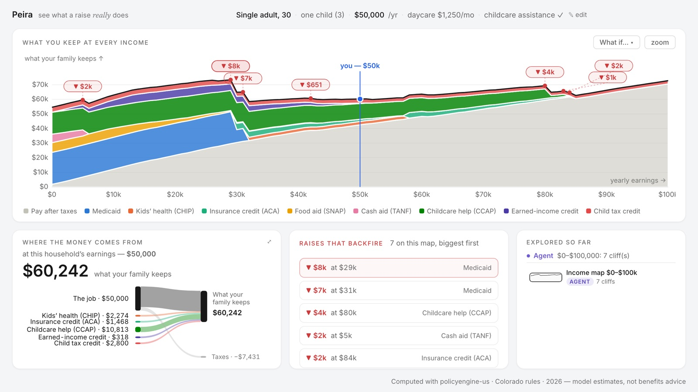
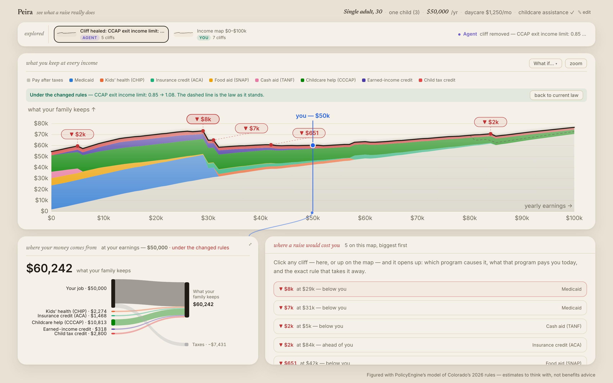

# Peira — see what a raise *really* does

**An agent-native instrument for the US benefits system.** Earn one more dollar at the wrong income and a family can lose thousands in benefits at once — a *benefit cliff*. Peira turns a real 600MB rules engine ([policyengine-us](https://github.com/PolicyEngine/policyengine-us)) into a shared lab bench where a person and a ChatGPT agent investigate those cliffs together through [WebMCP](https://webmachinelearning.github.io/webmcp/): the human owns the facts of their life and the judgment calls, the agent owns the probes.

*Peira* (πεῖρα): ancient Greek for "trial, probe, attempt" — the root of *empirical* and *experiment*. That's the method: understand the mechanism by probing it, not by explaining it.

Built for the [OpenAI WebMCP Challenge](https://webmcp.devpost.com/). Colorado rules, 2026, seven programs modeled: SNAP, Medicaid/CHIP, CCCAP childcare assistance, TANF, EITC, CTC, and ACA premium credits.



## Why this needs an agent (and not just a chart)

Benefit-cliff *visualizations* already exist — PolicyEngine's [CliffWatch](https://policyengine.org/us/cliffwatch) and the Atlanta Fed's [CLIFF tools](https://www.atlantafed.org/economic-mobility-and-resilience/advancing-careers-for-low-income-families) are good ones, and Peira credits both as prior art. What they can't do is *investigate*: knock a program out to reveal a hidden dependency, trace a cliff to the exact eligibility rule that causes it, overlay a changed life against today's, search a 2-D income×childcare grid for safe regions, or find the smallest rule change that would make a cliff disappear. Those are probe verbs, and probe verbs are what an agent is good at driving — while the human scrubs, clicks, corrects the household card, and decides what matters.

A session reads like a lab notebook: *"a raise past $80k loses $4,439 at once" → "why?" → the CCCAP re-determination rule lights up → "what if we married?" → overlay says always better → "could policy fix it?" → the cliff heals on screen (exit limit 0.85 → 1.08 of state median income).*



## The probe vocabulary (11 WebMCP tools)

All tools live in [`frontend/src/webmcp/tools.ts`](frontend/src/webmcp/tools.ts) — written to be read, with per-tool strategy notes for the model and design rules at the top. Registration is `document.modelContext.registerTool(...)` (with the legacy `navigator.modelContext` fallback), one `AbortController` for the set, zod re-validation inside every handler.

| Tool | | What it reveals |
|---|---|---|
| `set_household` | write | Describe the family; fills the card. The human can correct it by hand — corrections flow back to the agent. |
| `sweep` | read | Net resources across an earnings range → cliffs with recovery points ("worse off until $95k"), dead zones, curve checkpoints, you-are-here. |
| `query_point` | read | Exact readings off the curves already on the canvas — cheap, no recompute. |
| `trace_binding_constraint` | read | The *rule* behind a cliff — which eligibility test flips, its threshold, and the editable parameter that controls it. |
| `ablate_program` | read | Knock a program out → which *other* programs move (e.g. removing TANF silently costs SNAP $5,139 via categorical eligibility). |
| `diff_scenarios` | read | A changed life (marriage, hours, new baby) overlaid on today's, with crossing points and the gap at the family's own income. |
| `sweep_2d` | read | Earnings × childcare-cost grid with cliff ridges and safe regions — the probe no slider UI can do by hand. |
| `annotate` | write | Pin a finding on the canvas under the agent's own visual voice. |
| `edit_policy` | read* | Move one whitelisted rule parameter (server-side whitelist with bounds — agent-supplied paths never reach the engine) and re-map. |
| `find_minimal_fix` | read* | Search the whitelisted parameter space for the smallest change that heals a cliff. The finale. |
| `get_workbench` | read | The shared bench: household (with human hand-edits), selected cliff, scrub cursor, pins, recent human actions. |

\* "read" = no effect outside the page's canvas; policy edits are simulations, never real-world writes.

Two design rules do the most work:

- **Compact, analysis-bearing replies.** The agent can't see the canvas; its whole world is reply JSON. Every reply stays around a kilobyte of *derived* numbers (cliffs, recovery points, ridges, crossings) — never raw 101-point arrays. The screen is the shared memory; the reply is a pointer into it.
- **The bench is bidirectional.** WebMCP is pull-only, so every reply piggybacks a `human_did_meanwhile` digest of card edits, cliff clicks, and human-run probes since the agent's last call, and `get_workbench` gives an on-demand snapshot. Ask the agent "what do you make of what I just did?" and it answers from the digest.

Everything the agent can do, a person can do by hand: load a scenario, edit the household card, scrub the map, click cliff pills, run what-ifs and ablations, turn policy dials, zoom, pin notes. Human actions are green, agent actions are purple, and the probe log keeps the who-did-what trail.

## Run it

**Backend** (FastAPI + policyengine-us; ~15s warm-up, [uv](https://docs.astral.sh/uv/) required):

```sh
cd backend
uv run uvicorn app.main:app --port 8000
```

**Frontend** (Vite + React + TypeScript):

```sh
cd frontend
npm install
npm run dev   # http://localhost:5173
```

**With an agent:**
- **ChatGPT desktop app** — open `http://localhost:5173` in its built-in browser; the tools appear automatically as site tools. Try: *"I'm a single parent in Denver making $50k, my 3-year-old's daycare runs $15k a year, and we're already on childcare assistance (CCCAP) — is chasing a big raise actually worth it?"*
- **Chrome** — enable `chrome://flags/#enable-webmcp-testing`, then inspect via DevTools' WebMCP panel.
- **No agent** — the bench works standalone; scenario cards and hand controls cover the full probe vocabulary except the 2-D grid.

**Verify:**

```sh
cd backend && uv run pytest tests/          # 17 tests incl. the reference Colorado cliffs
cd frontend && npx tsx scripts/probe-e2e.ts # drives all 11 real tool handlers end-to-end
```

## Honesty notes

- Numbers are **model estimates from policyengine-us, not benefits advice**. Check with a caseworker before acting on anything here.
- `edit_policy` / `find_minimal_fix` show *mechanical* fixes and what they'd mean for this one household — not policy advocacy.
- Colorado is the verified wedge (its childcare subsidy, SNAP BBCE, TANF, Medicaid/CHIP and state credits are all fully modeled and spot-checked against known cliff values). The instrument is state-parameterized by design; other full-CCDF states are the natural next step.

## Prior art & credits

- **[PolicyEngine](https://policyengine.org)** — the `policyengine-us` engine this runs on, and CliffWatch, the prior art for cliff *visualization*.
- **Atlanta Fed** — the [CLIFF suite](https://www.atlantafed.org/economic-mobility-and-resilience/advancing-careers-for-low-income-families) proved caseworkers and workforce coaches will use cliff tooling in the field (PolicyEngine and the Atlanta Fed cross-validate under an MOU).
- Peira's contribution is the agent-native probe loop on top of a real rules engine: trace, ablate, diff, 2-D search, and mechanical repair, driven conversationally with the human in the loop.

## License

AGPL-3.0 (same as policyengine-us) — see [LICENSE](LICENSE).
